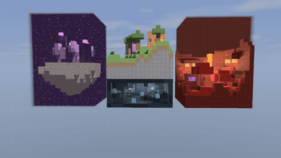

# Proyecto 2 — Diorama con Raytracing

Raytracer escrito **desde cero en Rust, sin dependencias externas** (`[dependencies]` vacío).
Renderiza un diorama estilo Minecraft con tres dimensiones puestas una al lado
de otra, construido con cubos texturizados y visto en corte (de frente, desde
`+z`):

- **Al centro, la isla del overworld**: terreno procedural de 16×16 con un lago,
  una cabaña de madera con ventanas de vidrio, un portal del Nether, antorchas y
  árboles.
- **Debajo de la isla, una cueva del Deep Dark**: pizarra profunda con relieve y
  estalactitas, manchas de sculk, sensores de sculk que brillan en cian y un
  fragmento de ciudad antigua (plataforma de ladrillo de pizarra, el marco de
  pizarra reforzada y dos linternas de almas). Sin el Warden.
- **A la derecha, el Nether**: lago de lava con acantilados de netherrack, una
  cascada de lava, glowstone colgando de repisas, hongos carmesí gigantes con
  shroomlight y el otro extremo del portal.
- **A la izquierda, el End**: isla flotante de piedra del End sobre el vacío
  estrellado, pilares de obsidiana con cristales del End, plantas de chorus y una
  torre de purpur con varas del End.

La cueva y la isla están separadas por una capa de piedra; entre la isla y cada
dimensión de los lados quedan 3 bloques de aire.

Incluye tres modos de uso: imagen fija, visor interactivo en el navegador y
secuencia de frames para armar un video.

## Video

[](diorama.mp4)

La vista previa de arriba es un GIF reducido; haz clic en ella o
[descarga el video en calidad completa](diorama.mp4) (960×540, 30 fps, 8 s).
Se generó con `cargo run --release -- animate` (movimiento `combo`: vuelta de
360° alrededor del diorama, subiendo y bajando, con dos acercamientos).

---

## Requisitos

- Rust estable (edición 2024) — `cargo`
- Opcional: `ffmpeg`, solo para convertir los frames del modo `animate` en video

El perfil `release` está configurado para rendimiento (`opt-level = 3`,
`lto = "fat"`, `codegen-units = 1`), así que **siempre conviene correr con
`--release`**: en modo debug el render es órdenes de magnitud más lento.

## Uso

```bash
# Visor interactivo (por defecto) -> http://127.0.0.1:8080
cargo run --release -- view [puerto]

# Imagen fija -> out/diorama.bmp y out/diorama.ppm
cargo run --release -- still [ancho] [alto] [supersampling]

# Secuencia de frames -> out/frame_0000.ppm ...
cargo run --release -- animate [ancho] [alto] [frames] [supersampling] [movimiento]
```

Valores por defecto:

| Modo      | Parámetros                                            |
|-----------|-------------------------------------------------------|
| `view`    | puerto `8080`                                         |
| `still`   | `1280x720`, supersampling `2` (4 rayos por píxel)     |
| `animate` | `960x540`, `240` frames, supersampling `2`, `combo`   |

Recorridos de cámara de `animate`:

| Movimiento | Qué hace                                                                 |
|------------|--------------------------------------------------------------------------|
| `combo`    | vuelta completa de 360° mientras sube y baja, con dos acercamientos por vuelta (de frente y de espaldas; el que conviene entregar) |
| `orbit`    | solo la vuelta completa alrededor del diorama                            |
| `vertical` | sube desde la altura de la cueva hasta la vista aérea                    |

Armar el video con los frames generados:

```bash
ffmpeg -framerate 30 -i out/frame_%04d.ppm -c:v libx264 -crf 18 -pix_fmt yuv420p diorama.mp4
```

### Controles del visor

El visor levanta un servidor HTTP con `std::net` y sirve una página que pide un
frame nuevo en cada movimiento de cámara
(`GET /frame?yaw=…&pitch=…&dist=…&w=…&h=…&ss=…&depth=…`), codificado como BMP.
Mientras la cámara se mueve pide un **borrador** (40 % de la resolución, sin
antialiasing y con un solo rebote); 250 ms después de soltar vuelve a pedir el
frame en calidad final (960×540, `ss = 2`, 3 rebotes).

| Acción                | Control                          |
|-----------------------|----------------------------------|
| Rotar (órbita)        | arrastrar con el mouse / `A` `D` |
| Cambiar altura        | `W` `S`                          |
| Zoom                  | rueda del mouse / `Q` `E`        |
| Reiniciar la cámara   | `R`                              |

## Características implementadas

- **Raytracing recursivo** con profundidad configurable por render
  (`RenderOpts::max_depth`, por defecto `render::MAX_DEPTH = 3`).
- **DDA voxel traversal** (algoritmo de Amanatides–Woo) sobre una **rejilla densa
  de voxeles** (`Vec<u8>`), con slab test contra el AABB de las celdas ocupadas
  para entrar y salir rápido.
- **Iluminación Blinn-Phong** (ambiente + difuso + especular con vector medio)
  con múltiples luces: sol lejano sin atenuación, y luces puntuales con
  atenuación cuadrática para la lava, cada glowstone, shroomlight, portal,
  antorcha, linterna de almas, sensor de sculk y cristal del End.
- **Iluminación por zonas**: cada dimensión es una caja (`render::Zone`) con su
  propia luz ambiente, y cada luz puede limitarse a una zona. El sol solo
  alumbra la isla (no entra a la cueva ni al Nether o al End, que no tienen sol);
  el Nether y el End llevan su propia luz general tenue (rojiza y lila). Los
  puntos fuera de la zona de una luz ni siquiera lanzan su rayo de sombra.
- **Niebla por caja**: los rayos que cruzan la cueva o el End sin chocar nada
  se tiñen del color de esa dimensión en vez de mostrar cielo azul; la del End
  además lleva estrellas.
- **Sombras** que respetan la transparencia: al cruzar agua, vidrio o el portal
  la sombra se tiñe y atenúa en lugar de bloquearse por completo. Los bloques
  emisivos no hacen sombra (son la fuente de luz), así que las luces puntuales
  pueden vivir dentro de su propio bloque.
- **Reflexión y refracción** con **Fresnel (aproximación de Schlick)**, índice de
  refracción por material y reflexión total interna como caso de respaldo.
- **Materiales emisivos** (lava, glowstone, portal, llama de antorcha, sensor de
  sculk, linterna de almas, cristal y vara del End, shroomlight). La emisión se
  multiplica por la textura, así que conservan su detalle.
- **Texturas procedurales** generadas en código, una por material (los 28 de la
  tabla de abajo) — sin archivos de imagen.
- **Normal mapping** derivado por filtro Sobel a partir de **mapas de altura
  suaves** (no de la textura de color), para piedra, madera, agua, netherrack,
  obsidiana, pizarra profunda, ladrillos, purpur, piedra del End y tallo
  carmesí. Los mapas normales se muestrean con filtrado bilineal.
- **Tone mapping** Reinhard sobre la luminancia (conserva el tono de los colores
  brillantes) y corrección gamma 2.2.
- **Skybox procedural**: degradado cenit/horizonte/suelo, nubes con fBm y disco
  solar. También soporta panorama equirectangular (`Sky::Panorama`).
- **Ruido propio**: hash entero, value noise y fBm, usados tanto para el terreno
  como para las texturas.
- **Render paralelo** con `std::thread::scope` y los hilos disponibles
  (`available_parallelism`). El framebuffer se parte en franjas de 4 filas que
  los hilos toman de una cola compartida conforme terminan: el reparto se
  balancea solo aunque unas zonas (el interior de la cueva) cuesten más que
  otras (el cielo). 1280×720 con 4 rayos por píxel tarda ~0.2 s con 24 hilos.
- **Antialiasing** por supersampling de rejilla (`ss × ss` rayos por píxel).
- **Lectura y escritura de imágenes propias**: BMP de 24 bits, PPM binario (P6) y
  un decodificador de PPM para texturas externas, sin librerías de imagen.

## Optimizaciones

El recorrido de rayos es el bucle más caliente del programa, así que el trabajo
está puesto ahí:

- **Rejilla densa en vez de `HashMap`**: consultar una celda es una multiplicación
  y un indexado, sin hashing.
- **AABB previo (slab test)**: los rayos que no tocan el diorama se descartan
  antes de empezar el DDA, y el recorrido se corta al salir de la caja.
- **Tope de pasos** (`world::MAX_STEPS = 192`) como red de seguridad para rayos
  rasantes.
- **Descarte de luces débiles**: si el aporte de una luz cae bajo un umbral, ni
  siquiera se lanza el rayo de sombra (las antorchas lejanas salen gratis).
- **Corte temprano de sombras**: la atenuación acumulada se aborta al bajar del
  2 %, con un máximo de 4 medios atravesados. El rayo de sombra salta el medio
  que acaba de cruzar para no volver a chocarlo.
- **Material ignorado en refracción**: el rayo que viaja *dentro* del agua o del
  vidrio salta ese material para no refractar en cada celda vecina del bloque.
- **Calidad adaptativa en el visor**: resolución, supersampling y rebotes bajan
  mientras la cámara se mueve y vuelven a subir al soltar.

## Materiales

Cada material tiene su propia textura procedural y sus propios parámetros de
albedo, especular, transparencia y reflectividad (0 = opaco / mate):

| # | Material   | Albedo (RGB)       | kd / ks / shininess | Transparencia (IOR) | Reflectividad | Extra                          |
|---|------------|--------------------|---------------------|---------------------|---------------|--------------------------------|
| 0 | Pasto      | 0.96, 1.00, 0.92   | 0.95 / 0.05 / 8     | 0                   | 0             |                                |
| 1 | Tierra     | 1.00, 0.96, 0.93   | 0.95 / 0.03 / 4     | 0                   | 0             |                                |
| 2 | Piedra     | 0.96, 0.97, 1.00   | 0.80 / 0.20 / 32    | 0                   | 0.04          | normal map                     |
| 3 | Madera     | 1.00, 0.95, 0.88   | 0.85 / 0.15 / 24    | 0                   | 0             | normal map                     |
| 4 | Agua       | 0.75, 0.92, 1.00   | 0.22 / 0.45 / 90    | 0.88 (1.33)         | 0.10          | normal map de olas, refracción |
| 5 | Lava       | 1.00, 0.85, 0.75   | 0.30 / 0.05 / 8     | 0                   | 0             | emisiva (1, 0.55, 0.25) × 2.2  |
| 6 | Obsidiana  | 0.95, 0.90, 1.00   | 0.75 / 0.35 / 150   | 0                   | 0.18          | normal map                     |
| 7 | Vidrio     | 0.88, 0.96, 0.92   | 0.05 / 0.60 / 200   | 0.92 (1.52)         | 0.08          | refracción                     |
| 8 | Netherrack | 1.00, 0.92, 0.90   | 0.70 / 0.05 / 10    | 0                   | 0             | normal map                     |
| 9 | Glowstone  | 1.00, 0.95, 0.85   | 0.40 / 0.10 / 16    | 0                   | 0             | emisiva (1, 0.85, 0.55) × 1.6  |
| 10| Portal     | 0.92, 0.85, 1.00   | 0.20 / 0.30 / 60    | 0.45 (1.10)         | 0.05          | emisiva (0.55, 0.18, 0.95) × 1.6 |
| 11| Llama      | 1.00, 0.95, 0.85   | 0.30 / 0.10 / 12    | 0                   | 0             | emisiva (1, 0.80, 0.55) × 1.8  |
| 12| Hojas      | 0.92, 1.00, 0.90   | 0.92 / 0.08 / 12    | 0                   | 0             |                                |
| 13| Pizarra profunda | 0.95, 0.97, 1.00 | 0.80 / 0.15 / 24 | 0                   | 0             | normal map                     |
| 14| Sculk      | 0.95, 1.00, 1.00   | 0.60 / 0.35 / 48    | 0                   | 0.03          |                                |
| 15| Sensor de sculk | 0.95, 1.00, 1.00 | 0.50 / 0.25 / 32 | 0                   | 0             | emisiva (0.30, 0.90, 1) × 1.2  |
| 16| Pizarra reforzada | 1.00, 1.00, 1.00 | 0.80 / 0.25 / 40 | 0                  | 0             | normal map                     |
| 17| Ladrillo de pizarra | 0.95, 0.97, 1.00 | 0.80 / 0.15 / 24 | 0               | 0             | normal map de juntas           |
| 18| Linterna de almas | 1.00, 1.00, 1.00 | 0.30 / 0.20 / 32 | 0                  | 0             | emisiva (0.40, 0.95, 1) × 1.8  |
| 19| Piedra del End | 1.00, 1.00, 0.95 | 0.90 / 0.05 / 10  | 0                   | 0             | normal map                     |
| 20| Purpur     | 1.00, 0.96, 1.00   | 0.85 / 0.15 / 30    | 0                   | 0             | normal map de juntas           |
| 21| Chorus     | 1.00, 0.95, 1.00   | 0.90 / 0.08 / 12    | 0                   | 0             |                                |
| 22| Cristal del End | 1.00, 1.00, 1.00 | 0.30 / 0.50 / 120 | 0                  | 0.10          | emisiva (1, 0.60, 1) × 1.5     |
| 23| Vara del End | 1.00, 1.00, 1.00 | 0.30 / 0.20 / 32    | 0                   | 0             | emisiva (1, 0.97, 1) × 1.6     |
| 24| Nylium carmesí | 1.00, 0.95, 0.95 | 0.90 / 0.05 / 10  | 0                   | 0             | normal map                     |
| 25| Tallo carmesí | 1.00, 0.95, 0.95 | 0.85 / 0.12 / 20   | 0                   | 0             | normal map                     |
| 26| Verruga del Nether | 1.00, 0.95, 0.95 | 0.90 / 0.05 / 10 | 0              | 0             |                                |
| 27| Shroomlight | 1.00, 0.95, 0.90  | 0.40 / 0.10 / 16    | 0                   | 0             | emisiva (1, 0.65, 0.35) × 1.6  |

La transparencia del agua y el vidrio tiene sentido en la escena: se ve el fondo
del lago y el interior de la cabaña, deformados por la refracción.

El índice de cada material dentro de `Scene::materials` **debe** coincidir con
las constantes `M_*` de `scene.rs`: ese índice es el byte que se guarda en cada
voxel de la rejilla.

## Estructura del código

```
src/
├── main.rs      # CLI: view / still / animate, escritura de PPM
├── server.rs    # visor interactivo (servidor HTTP + página con JS embebido)
├── render.rs    # Scene, Light, Zone, Fog, RenderOpts, trace(), sombras, render paralelo
├── world.rs     # rejilla densa de voxeles, AABB y recorrido DDA, UV por cara
├── scene.rs     # construcción del diorama: isla, cueva del Deep Dark, Nether y End
├── material.rs  # Material (builder), Fresnel-Schlick, marco tangente
├── texture.rs   # texturas procedurales, mapas de altura, normal maps, carga de PPM
├── sky.rs       # cielo procedural y panorama equirectangular
├── noise.rs     # hash, value noise, fBm
├── camera.rs    # cámara orbital (yaw / pitch / dist / fov)
├── bmp.rs       # codificación y escritura de BMP 24 bits
└── vec3.rs      # álgebra vectorial y conversión a RGB8
```

La escena se genera de forma determinista a partir de una semilla
(`scene::build(2026)`). Cada bioma ocupa 16×16 cubos de planta y están
alineados a lo largo de `x`:

| Bioma    | `x`         | `y`          | Notas                                         |
|----------|-------------|--------------|-----------------------------------------------|
| End      | `-19 … -4`  | `~1 … 20`    | isla flotante, caja de vacío hasta `y = 23`   |
| Cueva    | `0 … 15`    | `0 … 6`      | techo de piedra en `y = 7`, abierta al frente |
| Isla     | `0 … 15`    | `8 … ~21`    | mapa de alturas fBm, nivel del mar `y = 11`   |
| Nether   | `19 … 34`   | `0 … ~16`    | lago de lava en `y ≤ 2`, acantilados al fondo |

Antes de construir la cabaña y el portal de la isla se aplana el terreno bajo
su huella (`scene::flatten`) para que no los atraviese.
La rejilla se reserva con margen (de `(-21, 0, -2)` a `(37, 26, 19)`) para que
entren las copas de los árboles y las estructuras.

## Salida

Los archivos generados quedan en `out/` (ignorado por git):

- `out/diorama.bmp`, `out/diorama.ppm` — modo `still`
- `out/frame_0000.ppm`, … — modo `animate`
